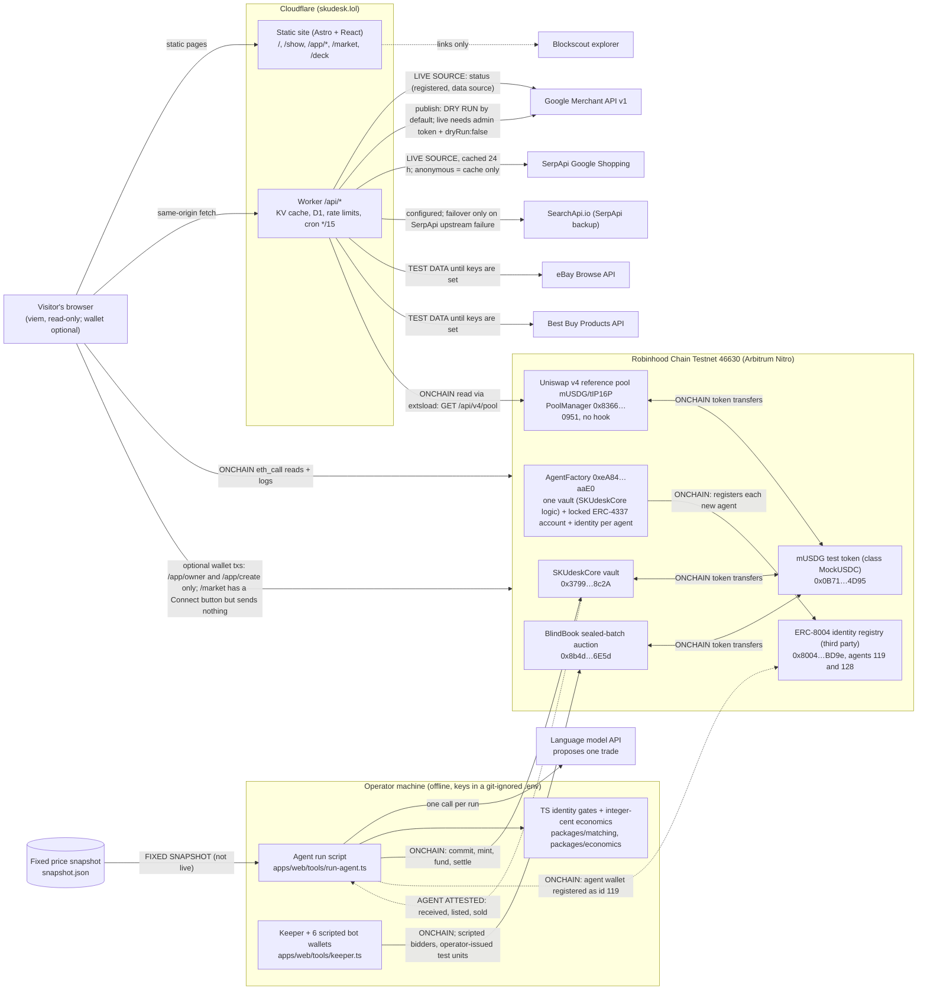

# SKUdesk architecture

> SKUdesk lets agents compete to find and bid for the same product in sealed-batch auctions; a vault limits what each agent can spend and records the proof on-chain.

Testnet prototype: price search, agent vault, sealed auction and a Uniswap v4 reference pool work today; ordering and delivery of real goods are still being connected.

The labels below describe the state on **2026-10-03 at about 16:20 UTC**, read from the live `/api/merchant/status`, `/api/prices/sources`, `/api/prices/compare` and `/api/v4/pool` and from chain 46630, for the system deployed on 2026-10-03 at 15:36 UTC (from block 128,228,499). See `verify-in-5-minutes.md` for the commands.

The edges use the same five labels as the site (`apps/web/src/lib/provenance.ts`): **ONCHAIN** (read from or written to a contract), **LIVE SOURCE** (fetched from a live data source), **FIXED SNAPSHOT** (recorded values that do not update), **TEST DATA** (placeholders, the real source is not connected) and **AGENT ATTESTED** (reported by the agent; the contract does not verify it).

## Diagram

Not in the diagram because they are not built: live Lazada and Shopee feeds (they appear as fixed demo listings), a buyer order and payment path, a link from the BlindBook clearing result to escrow, a delivery verifier, and a runtime that makes a user-created agent search and bid by itself.

How to read the edges:
- **TEST DATA** (API enum `MOCK`) means deterministic stand-in offers (`apps/web/worker/feeds/testdata.ts`). They are labelled TEST DATA in the UI (NOT CONNECTED on the Integrations table), never persisted, and never mixed into a spread built from live sources (`apps/web/worker/feeds/compare.ts:112-114`).
- **DRY RUN** means the exact payload that would be sent is returned and nothing reaches Google (`apps/web/worker/google/listing.ts:40-49`).
- The Uniswap v4 pool and BlindBook are not connected to each other: there is no oracle feed, no arbitrage keeper and no price sync (`docs/v4-pool.md`).

## The parts

| Part | What it is | Code |
|---|---|---|
| SKUdeskCore | The mandate vault. It re-derives the economics, derives the spend, enforces the caps, escrows funds, pays only allowlisted payees and settles on tokens received | `packages/contracts/src/SKUdeskCore.sol`, `EconLib.sol` |
| mUSDG (contract class `MockUSDC`) | "Test USDG (testnet stand-in)": a 6-decimal test token with an owner-only mint. Not real USDG, not USDC | `packages/contracts/src/MockUSDC.sol:4-26` |
| BlindBook | A commit-reveal, uniform-price batch auction over 45-second epochs (20 s commit, then reveal until 35 s, then clear). Price-time priority, so ties go by commit order. At most 24 orders per market and epoch | `packages/contracts/src/BlindBook.sol` |
| AgentFactory and AgentAccount | One transaction creates a vault, a locked ERC-4337 account (it may only call its own vault) and an identity token in the ERC-8004 registry already on the chain | `AgentFactory.sol`, `AgentAccount.sol`, `AgentIdentityRegistry.sol` |
| ERC-8004 registry | The third-party, upgradeable registry where the run's agent wallet holds id 119 (registered before the redeploy) and the recorded factory example is id 128 | `docs/agent-identity.md` |
| Uniswap v4 reference pool | A standard v4 pool for mUSDG and tIP16P (a test token for units of the case). Fee 0.3%, tick spacing 60, no hook. Two helper contracts add liquidity and swap. It delivers no goods | `packages/contracts/src/v4/`, `docs/v4-pool.md`, `packages/contracts/deployments/v4-pool-mUSDG-46630.json` |
| Agent run script | Offline. It loads the snapshot, asks the language model for one trade, runs the gates, then sends the transactions and the read-only tampering calls | `apps/web/tools/run-agent.ts` |
| Keeper and bots | Six scripted bot wallets place sealed orders and clear epochs for the markets. Run by the operator | `apps/web/tools/keeper.ts` |
| Static site | Built from `run.json`, `snapshot.json` and the deployment files. It reads the chain live in the browser | `apps/web/src/` |
| Worker | `/api/*` only. It handles Merchant status and listings, price sources and compare, the v4 pool read, and the cron | `apps/web/worker/` |

## Trust boundaries

| Boundary | Who is trusted | What is enforced | What is not |
|---|---|---|---|
| Agent → vault | Nobody. The agent is assumed hostile | Quote hash, future-time check, replay id, freshness (on the time the agent claims), field bounds, spend derived and capped, daily commitment cap, net and margin re-derived, margin floor (`SKUdeskCore.sol:115-139`) | That the input prices are true. That `observedAt` and `snapshotHash` are honest (F-V3, F-V4). The product match (off-chain gates) |
| Vault → money out | The owner's allowlists | Escrow goes only to allowlisted payees (`SKUdeskCore.sol:193-200`); funding equals the committed spend exactly (`:183-190`) | Whether the purchase really happened. Received, listed and sold are agent-attested (`:201-204`) |
| Settlement | The allowlisted payer | Profit is counted only on tokens actually received (`:207-218`) | The sale price. Proceeds are chosen by the agent within the payer's allowance (F-V5). In the run, the payer is the owner's own address (`packages/contracts/deployments/46630.json`) |
| Owner → everything | One owner key (`0x6129…5501`) | — | The owner can pause, change the policy, withdraw free funds, mint mUSDG, `issue` BlindBook units and take the BlindBook treasury |
| BlindBook bidders | Nobody | Hash-checked reveals, funds reserved at reveal, uniform price, conservation (`BlindBook.sol:97-137`) | Prices are not secret until clearing: orders are revealed before the clear transaction, and early reveals are visible (F-B6). Owner pause during reveal forfeits unrevealed bonds (F-B1). `issue` is unbacked (F-B3). No link to buyer payment, escrow or delivery |
| Browser → Worker | Nobody | Same-origin only; 16 KB JSON bodies; rate limits; live Merchant writes need a constant-time admin-token check plus `dryRun:false` (`apps/web/worker/security.ts:19-47`) | The rate limits are per Cloudflare location, so they act as a brake, not a security boundary |
| Worker → price feeds | The vendors' data | Integer-cent parsing, US/USD only, identity gates before an offer counts, test data kept out of live spreads | Whether a vendor's price is right. SerpApi offers lock on title gates only, with no GTIN |
| Worker → v4 pool read | The RPC | Read-only `extsload`; a failed read answers `DEGRADED`, never a made-up number | The pool's price says nothing about goods. The owner can mint the pool's test tokens and withdraw the seed position |
| Secrets | Cloudflare secrets and a local git-ignored `.env` | Never in source, logs or responses. A build test scans the output (`apps/web/test/built/no-secrets.test.mjs`) | — |

## One trade, step by step (lot 1)

The product is the iPhone 16 Pro Clear MagSafe Case: the lot's `productHash` is `keccak256("CASE-IP16PRO-CLEAR-MAG-001")`. The offers are from a fixed snapshot.

| # | Where | Step | Evidence |
|---|---|---|---|
| 1 | Chain → agent | Read the mandate: per-trade cap $2,500, daily cap $5,000, margin floor 18%, TTL 180 s | `run.json` event 1 |
| 2 | Agent | Load the 10-offer snapshot and hash it (`snapshotHash 0x30b0…76da`) | event 2 |
| 3 | Agent → model | The AI agent proposes: buy `shopee-8841`, sell `google-5501`, 350 units | events 3-9 |
| 4 | Agent | The identity gates lock both offers as the same SKU | events 10-11 |
| 5 | Agent | Integer economics: landed 659, net 261, margin 2374 bps | event 12 |
| 6 | Chain | `commitOpportunity`: the contract re-derives everything and records spend 230,650 cents | tx `0x2eef…99ab` (event 13) |
| 7 | Chain | `mintLot`, which creates lot 1 from the committed opportunity | tx `0x68bd…d97a` (event 14) |
| 8 | Chain | `fundLot`, which moves exactly $2,306.50 into escrow | tx `0x67d5…43cf` (event 15) |
| 9 | Agent → chain | Six tampering attempts, made as read-only calls. The inflated-profit one is also mined and reverts | events 16-22, tx `0xcbc1…e056` |
| 10 | Chain | `markPurchased`, which pays escrow to the allowlisted supplier | tx `0xdfca…17ca` (event 23) |
| 11 | Chain | `markReceived`, `markListed`, `markSold`, all AGENT ATTESTED | txs `0xa0e9…`, `0xb161…`, `0xab5a…` (events 24-26) |
| 12 | Chain | `settle`, which pulls 3,220 mUSDG from the payer (the owner's own address). The script sized it as (net + landed) × units (`run-agent.ts:210`), so realized $913.50 = 261 × 350 by construction | tx `0x9a6d…d384` (event 27) |

## Target flow (not built yet)

| # | Step | State |
|---|---|---|
| 1 | Pick product | Built on testnet (six listed markets) |
| 2 | Agents find sources | Built on testnet, partly: the Worker compares sources with identity gates; Google Shopping is live, eBay and Best Buy are test data, Lazada and Shopee are integrated for demo purposes (fixed snapshot listings, no live API); no runtime makes a user-created agent search by itself |
| 3 | Sealed bids | Built on testnet, scripted: six bot wallets, operator-issued test units |
| 4 | Round clears | Built on testnet: one price per epoch, ties by commit order, prices revealed before the clear transaction |
| 5 | Buyer pays | Not built: no buyer order or payment in the market, no link from the clearing result to escrow |
| 6 | Delivery confirmed | Not built: no delivery attestation by a named verifier, no seller bond or verified inventory |
| 7 | Seller paid | Not built: no payout tied to confirmed delivery, no refund or dispute states |

## What is NOT trustless

- **Prices.** The contract checks arithmetic, not truth. The agent run used a fixed snapshot. Its hash is committed, so a lie can be audited after the fact but is not prevented.
- **Product identity.** This is checked by TypeScript gates off-chain. The contract only sees `productHash`.
- **Agent-chosen inputs.** These are `observedAt`, `snapshotHash` and the settlement `proceeds` (FINDINGS F-V3, F-V4, F-V5).
- **The real world after escrow.** Purchase, receipt, listing and sale are attested by the agent. Buyer payment and delivery are not built.
- **The daily cap.** It bounds new commitments per UTC day, not cash-out. Committed opportunities never expire (F-V1).
- **The owner.** A single EOA owns the vault, the test token's mint and BlindBook (pause, `issue`, treasury).
- **BlindBook liquidity and units.** Liquidity comes from our own scripted bots, and "units" are operator-issued test units, not tied to real stock.
- **Bid secrecy.** Bids are hashes until reveal, but prices are visible before the round clears.
- **The Uniswap v4 pool.** Test tokens, one seed position, no link to BlindBook, no delivery of goods.
- **The ERC-8004 registry.** It is someone else's upgradeable proxy with an unverified implementation.
- **The Worker.** It is a normal web backend run by us. Its labels are honest about where data came from, but nothing about it is on-chain.
